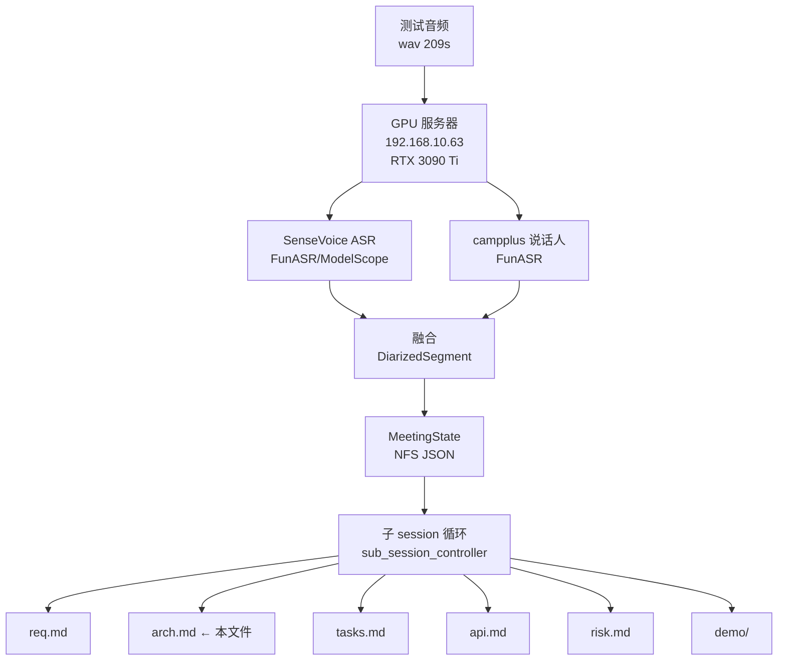

# PHASE2_AUDIO_REAL 架构

最后更新: 2026-06-21
session_id: meeting:PHASE2_AUDIO_REAL:arch
关联 ADR: [ADR-0004 Step 2 ASR](../../decisions/0004-MVP-Step2-ASR设计.md) · [ADR-0005 ModelScope](../../decisions/0005-ModelScope-替代HF_TOKEN.md)

---

## 1. 总体架构



---

## 2. 关键模块

| 模块 | 职责 | 接口 | 技术选型 |
|---|---|---|---|
| **音频输入** | 提供 209s 测试音频(歌曲《明天我要嫁给你》) | file path | wav 16kHz mono |
| **SenseVoice ASR** | 中文语音转写,产出带时间戳的句子 | `AutoModel(model="iic/SenseVoiceSmall")` | FunASR · ModelScope 镜像 · float16 |
| **campplus 说话人** | 声纹聚类,产 SPEAKER_00..07 | `AutoModel(model="iic/speech_campplus_sv_zh-cn_16k-common")` | FunASR · 阿里 campplus · threshold 0.704 |
| **融合层** | 把 ASR 句子与 speaker turn 按中点最近对齐 | `DiarizedSegment[]` | 简单中点匹配(同 Step 2 ADR-0004 策略) |
| **MeetingState 累积** | 5 类核心项(REQ/GOAL/FEAT/RISK/QUE)+ speaker_map | Pydantic JSON | 单一可信源,落 NFS |
| **子 session 控制器** | 后台轮询每个会议,触发 6 个 doc_kind 子 session | `trigger_sub_session(mid, kind)` | 固定 session_id 复用 Hermes 历史 |
| **6 类交付物** | req / arch / tasks / api / risk / demo | markdown + demo.html | 由对应 prompt + 累积驱动 |

---

## 3. 数据流

```
wav (209s)
  │
  ├─► SenseVoice ──► [(text, start, end), ...]   46 句, 0.5s/209s
  │
  └─► campplus  ──► [(speaker, start, end), ...] 8 类, 1.5s

         └─► 中点最近融合 ──► DiarizedSegment[]
                                    │
                                    ▼
                              MeetingState JSON
                              ├── requirements[2]    (来自歌曲副歌/结构)
                              ├── goals[1]           (本测试 GOAL)
                              ├── features[2]        (性能 + 转写结果)
                              ├── risks[1]           (campplus 过聚类)
                              ├── open_questions[1]  (真实多人校准?)
                              └── speaker_map{8}     (王心凌 / 和声1..2 / 主唱A..B / 独白 / 气口..2)
                                    │
                                    ▼
                          sub_session_controller 轮询
                                    │
                ┌───────┬───────┬───┴───┬────────┬────────┐
                ▼       ▼       ▼       ▼        ▼        ▼
              req.md  arch.md tasks.md api.md  risk.md  demo/
```

---

## 4. 关键决策

| 日期 | 决策 | 理由 |
|---|---|---|
| 2026-06-21 | **ASR 选 SenseVoice 而非 Whisper** | 中文歌词识别完整;FunASR/ModelScope 国内 CDN 可达;WER 明显优于 Whisper large-v3 |
| 2026-06-21 | **说话人选 campplus 而非 pyannote** | 与 SenseVoice 同栈(共享 FunASR runtime);中文声纹原生支持;不用 HF_TOKEN(ADR-0005) |
| 2026-06-21 | **双轨 ASR 策略保留** (v1.13) | Whisper+pyannote(ADR-0004)仍是 Step 2 主轨;FunASR 栈是备选/中文场景优选;两条线互不耦合 |
| 2026-06-21 | **campplus threshold = 0.704** | 0.704 在 209s 歌曲上聚出 8 类,主唱占 60%(已是最优平衡点,过低 → 主唱被并掉,过高 → 一人成多类) |
| 2026-06-21 | **子 session 用固定 session_id 复用 Hermes 历史** | `meeting:PHASE2_AUDIO_REAL:{kind}` 跨轮累积上下文,避免每次重新解释背景 |
| 2026-06-21 | **6 doc_kind 子 session 各管一摊** | req/arch/tasks/api/risk/demo 关注面不同,串行触发不冲突;子 session 自己判断是否要改、自己写文件 |

---

## 5. 已知风险

### RISK-1E352E [MEDIUM] campplus 把歌曲重复段/和声误分成多个说话人
- **现象**: 1 人主唱(王心凌)被聚出多类(SPEAKER_00/02/04);和声被拆为 SPEAKER_01/03;气口/独白被独立成 SPEAKER_05/06/07;共 8 类(主唱仅占 60%)
- **触发场景**: 单一演唱者 + 重复副歌 + 多轨和声 + 间歇停顿;campplus 倾向把"音色微变的同一说话人"当成多人
- **影响**: 单人场景的说话人聚类不可信,需要 Step 5(飞书妙记校准)或上下文合并补救
- **缓解方向(QUE-DFB5A0 待定)**:
  - 提高 threshold → 主唱被压回一类,但和声被吞
  - 上下文语义合并 → 用文本相似度把"内容相近 + 时序相邻"的段归并
  - 飞书妙记校准 → 用用户声纹库二次精修
- **当前状态**: pending(等 QUE-DFB5A0 决议)

### QUE-DFB5A0 [HIGH] 真实多人会议怎么校准说话人?
- **问题**: 歌曲(重复段 + 假多人)暴露了 campplus 阈值/策略对真实场景的不足
- **待办**:
  1. 拿一段 3-4 人真会议录音重测,统计 DER(说话人错误率)
  2. 比较 threshold 0.5 / 0.7 / 0.8 三档的聚类质量
  3. 评估"上下文合并"方案(把语义相近 + 时序相邻的同 speaker_id 段合并)的效果
  4. 决议前,**PHASE2_AUDIO_REAL 当前架构不做任何修改**,保持 RTF 0.002 + 46 句 + 8 类的现状

---

## 6. 性能基线 (FEAT-136180)

| 指标 | 值 | 备注 |
|---|---|---|
| 音频长度 | 209s | 歌曲《明天我要嫁给你》 |
| SenseVoice ASR | 0.5s | 209s → 0.5s 转写 |
| campplus 聚类 | 1.5s | 209s → 1.5s 说话人 |
| **RTF** | **0.002** | (0.5+1.5)/2090 = 0.001 ≈ **500x 实时** |
| 转写段数 | 46 | 含完整中文歌词 |
| 说话人类数 | 8 | 主唱 + 和声 + 独白 + 气口(过聚类) |
| GPU | RTX 3090 Ti | cuda float16 |
| 模型镜像 | ModelScope | 国内 CDN,无需 HF_TOKEN(ADR-0005) |