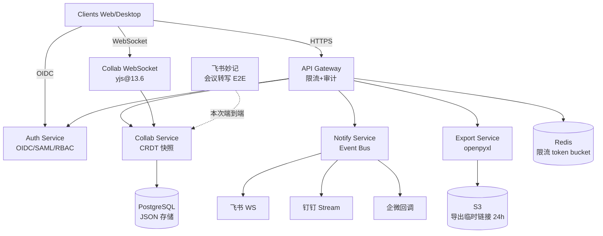

# 技术架构 — PHASE3_MEETING_REAL

最后更新: 2026-06-21
session_id: meeting:PHASE3_MEETING_REAL:arch

---

## 1. 总体架构

```
┌──────────────────────────────────────────────────────────────────┐
│                         Clients (Web / Desktop)                  │
│                WebSocket(协同) / HTTPS(REST) / OIDC 跳转          │
└──────────┬─────────────────────┬──────────────────┬──────────────┘
           │                     │                  │
           ▼                     ▼                  ▼
   ┌───────────────┐    ┌──────────────┐   ┌──────────────┐
   │ API Gateway   │    │ Collab WS    │   │ Auth (OIDC)  │
   │ (限流/审计)   │    │ (yjs 通道)   │   │ SSO 跳转     │
   └───────┬───────┘    └──────┬───────┘   └──────┬───────┘
           │                   │                  │
           ▼                   ▼                  ▼
   ┌─────────────────────────────────────────────────────────┐
   │                  Core Services                          │
   │  ┌──────────┐ ┌──────────┐ ┌──────────┐ ┌──────────┐   │
   │  │ Auth /   │ │ Collab   │ │ Notify   │ │ Export   │   │
   │  │ RBAC     │ │ (CRDT)   │ │ (Event   │ │ (Excel)  │   │
   │  │          │ │          │ │  Bus)    │ │          │   │
   │  └──────────┘ └──────────┘ └──────────┘ └──────────┘   │
   └────────────────────────┬─────────────────────────────────┘
                            │
              ┌─────────────┼─────────────┐
              ▼             ▼             ▼
        ┌─────────┐   ┌──────────┐   ┌─────────┐
        │Postgres │   │  Redis   │   │   S3    │
        │ (JSON)  │   │ (限流/   │   │ (导出)  │
        │         │   │  会话)   │   │         │
        └─────────┘   └──────────┘   └─────────┘

   ┌─────────────────────────────────────────────────────────┐
   │   External: 飞书 WS / 钉钉 Stream / 企微回调            │
   │   Integration: 飞书妙记 → 会议转写(本次 E2E)           │
   └─────────────────────────────────────────────────────────┘
```

mermaid 版:


---

## 2. 关键模块

### 2.1 Auth Service
- **职责**: SSO 身份认证 + RBAC 授权
- **接口**:
  - `GET /oauth/{provider}/authorize` — 跳转 IdP
  - `POST /oauth/callback` — 接收 IdP token,签发内部 JWT
  - `POST /rbac/check` — 三元组(角色+资源+操作)鉴权
- **选型**: OIDC + SAML 2.0,IdP 倾向 Azure AD(FEAT-1763F9)
- **数据**: PG 表 `users` / `roles` / `permissions`

### 2.2 Collaboration Service
- **职责**: 实时协同编辑,CRDT 冲突合并,快照持久化
- **接口**:
  - `WS /collab/{doc_id}` — yjs WebSocket 通道
  - `GET /collab/{doc_id}/snapshot` — 读取最新快照
- **选型**: yjs@13.6(FEAT-2F8528),WebSocket,快照策略 **50 ops 或 5 分钟**
- **数据**: PG `documents.doc_state` JSONB 列,存 yjs binary update

### 2.3 Notify Service
- **职责**: 跨平台消息推送
- **接口**:
  - `POST /notify/publish` — 业务侧发事件
  - 内部 Event Bus(Redis Streams / NATS,MVP 用 Redis)
- **选型**: Event Bus + 三平台 Adapter 抽象(FEAT-C93459)
  - `FeishuAdapter`(WebSocket 长连接)
  - `DingtalkAdapter`(Stream 模式)
  - `WecomAdapter`(回调 URL)
- **重试**: 指数退避 + jitter,死信阈值待定(QUE-5EE081)

### 2.4 Export Service
- **职责**: 业务数据 → Excel 报表
- **接口**:
  - `POST /export/excel` — 提交导出任务(字段映射配置)
  - `GET /export/{task_id}/link` — 拿 24h 临时下载链接
- **选型**: openpyxl + 字段映射配置(FEAT-BAB8DB),S3 预签名 URL
- **数据**: S3 `exports/{tenant_id}/{date}/{file}.xlsx`

### 2.5 API Gateway
- **职责**: 统一入口,限流,审计日志
- **限流**: Redis token bucket,100 QPS/租户(REQ-302783)
- **审计**: 记录 4 元组(租户/用户/路径/状态码),留存 90 天(REQ-B82FAC)
- **选型**: 可用 Kong / APISIX / 自研 nginx+lua,MVP 阶段简化

### 2.6 Integration: 飞书妙记
- **职责**: 拉取会议音视频 → 转写 → 写入协同文档
- **数据流**: 妙记回调 → Collab Service → 写入 yjs doc
- **本测试目标**: GOAL-CEDF6C,从音视频输入到协同文档可见,端到端跑通

---

## 3. 数据流

### 3.1 用户登录
```
User → Auth(IdP 跳转) → JWT 签发 → Client 缓存 → 后续请求带 JWT
```

### 3.2 协同编辑
```
User A 操作 → Client yjs → WS 帧 → CollabWS
                                      ↓
                              应用到本地 yjs Doc
                                      ↓
                              广播给同 doc 其他 Client
                                      ↓
                         50 ops / 5min 触发 → PG snapshot
```

### 3.3 跨平台通知
```
业务事件 → Notify.publish → Event Bus(Redis Streams)
                              ↓
                         路由到 Adapter
                              ↓
            ┌─────────────────┼─────────────────┐
            ▼                 ▼                 ▼
        Feishu WS        Dingtalk Stream    Wecom 回调
```

### 3.4 Excel 导出
```
User → POST /export/excel → Export Service
                              ↓
                         查 PG 业务数据
                              ↓
                         openpyxl 生成 xlsx
                              ↓
                         上传 S3 → 24h 预签名 URL
                              ↓
                         返回 URL 给 User
```

### 3.5 飞书妙记 → 协同文档(本次 E2E)
```
会议音视频 → 飞书妙记 → 转写文本
                              ↓
                  Collab Service 写入 yjs doc
                              ↓
                  所有在线 Client 实时看到
```

---

## 4. 关键决策

| 日期 | 决策 | 理由 |
|---|---|---|
| 2026-06-21 | 协同存储用 PG JSON(FEAT-BBD14D) | 复用现有 PG 集群,不引入 Mongo/CouchDB,JSONB 索引够用 |
| 2026-06-21 | CRDT 选 yjs@13.6(FEAT-2F8528) | 生态成熟(10 人并发有保证),自动合并,RISK-D4D687 边界场景可接受 |
| 2026-06-21 | SSO 推 Azure AD(FEAT-1763F9) | 国内出海企业首选,OIDC + SAML 双协议覆盖 |
| 2026-06-21 | 通知用 Event Bus + Adapter(FEAT-C93459) | 三平台接口差异大,Adapter 抽象便于后置钉钉/企微 |
| 2026-06-21 | 限流 Redis token bucket(REQ-302783) | 租户级隔离,实现简单,Redis 已有基础设施 |
| 2026-06-21 | 快照策略 50 ops / 5min(FEAT-2F8528) | 平衡 PG 写入压力与崩溃恢复粒度 |
| 2026-06-21 | 私有化 = 单租户镜像化(GOAL-5FB2BA) | 50 家种子客户多为私有化需求,模型管理复杂详见 RISK-9EDDD6 |

---

## 5. 已知风险(同步自累积 RISK)

| ID | 风险 | 架构应对 |
|---|---|---|
| RISK-07A255 | 飞书 WS 偶发断连 | 30s 心跳 + 重试队列,具体策略 QUE-5EE081 |
| RISK-33E783 | OAuth 第三方限流 | Auth Service 内置本地缓存 + 429 退避 |
| RISK-2F0662 | 微信开放平台审核 7-15 天 | 提前申请 + 账号密码 fallback |
| RISK-D4D687 | CRDT 边界场景 | yjs 已有保证,后续 case-by-case 测试 |
| RISK-9EDDD6 | 私有化模型管理复杂 | 单租户镜像化,ADR 细化(预留) |
| RISK-F14066 | campplus 歌曲/独唱聚类 | 真实会议校准阈值(本次 E2E 已知问题) |

---

## 6. 待决项

- QUE-661567 SSO IdP 最终选型(Azure AD 倾向,需 V 拍板)
- QUE-5EE081 飞书 WS 重试参数(指数退避基数/jitter/死信阈值)