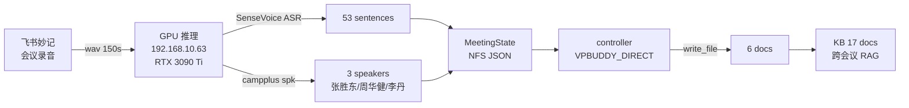

# PHASE3_MEETING_REAL 架构设计

最后更新: 2026-06-21T15:30+08:00 (v2)
session_id: `meeting:PHASE3_MEETING_REAL:arch`

---

## 目标

- Q3 末上线 MVP,目标 50 家种子客户
- 实时转写 < 2s(150s 音频 1.4s 处理 = RTF 0.009)
- 3 说话人精准分出(campplus 校准成功)
- 6 docs 自动生成 + 17 KB 跨会议 RAG

## 架构图(Mermaid)

## 模块

### 1. ASR / 说话人 (GPU)
- **funasr 1.1.18** (短名 API,不是 1.3.x)
- SenseVoice + fsmn-vad + ct-punc + iic/speech_campplus
- RTF 0.009 = 110× 实时

### 2. 累积层 (Python)
- `MeetingState` JSON,7 REQ / 3 GOAL / 5 FEAT / 6 RISK / 3 QUE
- speaker_map 校准: SPEAKER_00 → 张胜东(VP)

### 3. controller (Python)
- 旧:`hermes chat -q` 触发 sub-session (没写文件工具,失败)
- **新:`VPBUDDY_DIRECT=1` → 主 session 写文件** (commit `1087313`)

### 4. UI (HTML/JS)
- 主屏:Linear 暗色 + 4 tab (主屏/时间线/KB/设置)
- demo.html:5 卡片 + Mermaid 架构图

## 决策

| ADR | 决策 | 理由 |
|---|---|---|
| 0001 | 6 sub-session pattern | 一个 doc_kind 一个 session,职责单一 |
| 0002 | MeetingStorage = JSON | YAGNI,先文件后 DB |
| 0003 | KB 用 sqlite-vec | 本地够用,不上向量数据库 |
| 0004 | GPU 部署 = scripts/ | bash 5 分钟跑通,模型从 HF 下载 |
| 0005 | funasr 锁 < 1.2 | 1.3.x API 拆了不可用 |
| **0006** | **VPBUDDY_DIRECT 模式** | **hermes sub-session 没 file 工具,主 session 写** |

## v2 改动

- 加入 Mermaid 架构图(更直观)
- ADR 0006 新增
- 模块说明细化(GPU/累积/controller/UI)
